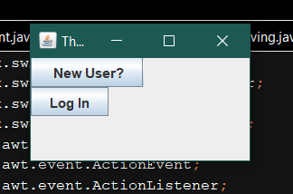

# Buidling things badly in a weekend: Project No. 1 (The Bank Sys)
--------------------------------------------------------------------
This is a swing desktop app that acts as a dashboard for a simple bank application. It support basic login , creating new user and a very basic dash board that show all the account details, let you create/open a new account,deposit or withdraws from that account.

-----------------------------------------------------------

###  Here are some gifs and images of it working
--------------------------------------------------------
#### Init frame

#### Login 

#### Account Panel 

#### Withdraw Example

#### Overdraft warning

